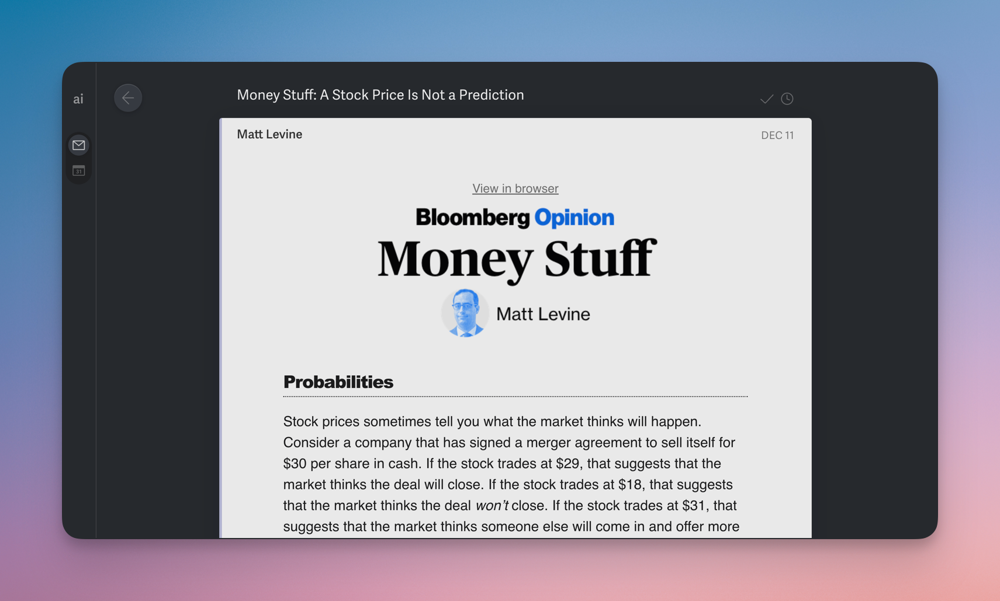

# Zenhuman

A Chrome extension that gives Superhuman a cleaner, calmer interface.

## Features

- **Hide right panel** - Removes the contact enrichment sidebar
- **Compact headers** - Smaller email headers, hides share/navigation buttons
- **Hide tooltips** - Removes keyboard shortcut hints and notifications
- **Simpler Inbox Zero** - Hides streak message, team button, referral/help/calendar icons on inbox zero screen

## Installation

1. Download or clone this repository
2. Open `chrome://extensions/` in Chrome
3. Enable "Developer mode" (top right)
4. Click "Load unpacked" and select the extension folder
5. Open Superhuman and click the extension icon to configure

## License

MIT
